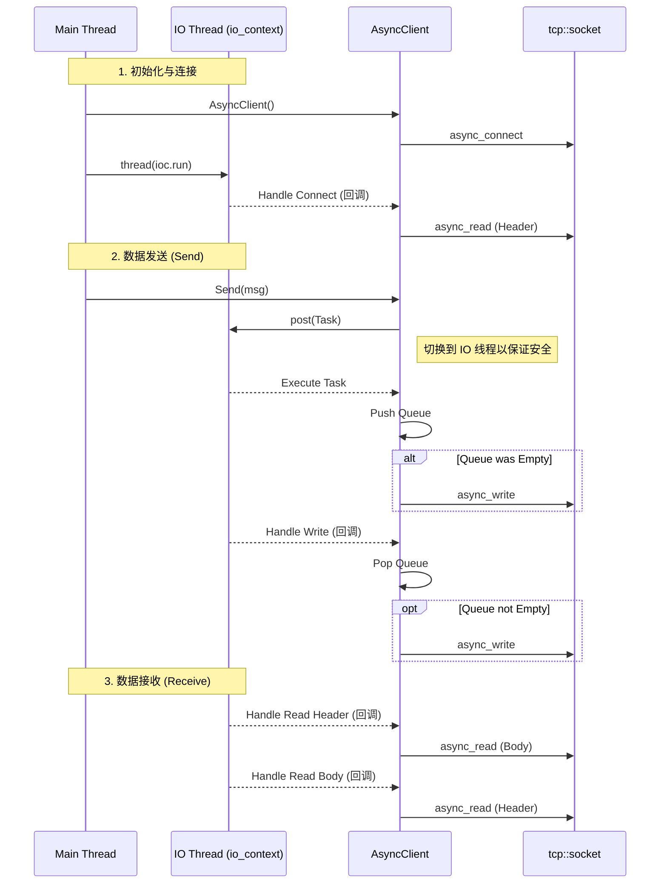

# Async Client 学习笔记

这是一个基于 Boost.Asio 的**异步 (Asynchronous)** TCP 客户端实现。它被设计为与 `v2_FullDuplex` 服务器配合使用，支持全双工通信和自定义消息协议。

## 目录结构

```
AsyncClient/
├── AsyncClient.h      # 客户端类声明
├── AsyncClient.cpp    # 客户端类实现
├── main.cpp           # 主程序入口
└── README.md          # 说明文档
```

## 核心功能

1.  **全双工通信**: 
    - 发送和接收互不干扰。
    - 使用 `io_context` 在后台线程处理网络 I/O。
    - 主线程专注于处理用户输入。

2.  **发送队列 (`_send_queue`)**:
    - 解决了 Boost.Asio 不允许并发 `async_write` 的问题。
    - `Send()` 函数是线程安全的，通过 `boost::asio::post` 将任务投递到 I/O 线程执行。

3.  **消息协议**:
    - 采用 `Header (2 bytes) + Body` 的格式。
    - 解决了 TCP 粘包问题。
    - 与服务器端的 `MsgNode` 协议保持一致。

## 调用关系图解

```mermaid
sequenceDiagram
    participant User as Main Thread (User Input)
    participant Client as AsyncClient
    participant IO as IO Thread (io_context)
    participant Socket as tcp::socket

    Note over User, IO: 1. 初始化与连接
    User->>Client: AsyncClient(host, port)
    Client->>Socket: async_connect
    User->>IO: thread t([&]{ ioc.run(); })
    IO->>Socket: Connect Complete
    Socket-->>Client: Callback (do_connect)
    Client->>Socket: async_read (Header)

    Note over User, IO: 2. 发送消息 (线程安全)
    User->>Client: Send("Hello")
    Client->>IO: post(Task)
    Note right of Client: 切换到 IO 线程执行
    IO->>Client: Task Execution
    Client->>Client: Push to Queue
    
    alt Queue was empty
        Client->>Socket: async_write
    end

    Note over IO, Socket: 3. 接收消息 (循环)
    Socket-->>Client: Read Header Complete
    Client->>Socket: async_read (Body)
    Socket-->>Client: Read Body Complete
    Client->>User: Print Reply
    Client->>Socket: async_read (Next Header)
```

## 关键代码解析

### 1. 线程安全的发送 (Send)

```cpp
void AsyncClient::Send(const string& msg) {
    // 使用 post 将任务切到 io_context 线程，避免多线程竞争 socket
    boost::asio::post(_socket.get_executor(), [this, msg]() {
        bool write_in_progress = !_send_queue.empty();
        // ... 封装消息 ...
        _send_queue.push(send_data);
        if (!write_in_progress) {
            do_write();
        }
    });
}
```

### 2. 读写循环

-   **读取**: `do_read_header` -> `do_read_body` -> `do_read_header` ... (无限循环，直到出错)
-   **写入**: `do_write` -> 回调中检查队列 -> 若不空则再次 `do_write`。

## 编译与运行

### 编译命令 (MinGW)

```bash
g++ -o AsyncClient.exe main.cpp AsyncClient.cpp -lws2_32 -lboost_system -std=c++20
```

### 运行

1.  确保服务器 (`AsyncServer.exe`) 正在运行。
2.  运行客户端:
    ```bash
    ./AsyncClient.exe
    ```
3.  在控制台输入消息并回车，查看服务器回显。
4.  输入 `quit` 退出。

## 调用关系图解 (Call Flow)

以下时序图展示了主线程（用户输入）与 IO 线程（网络处理）之间的交互：


