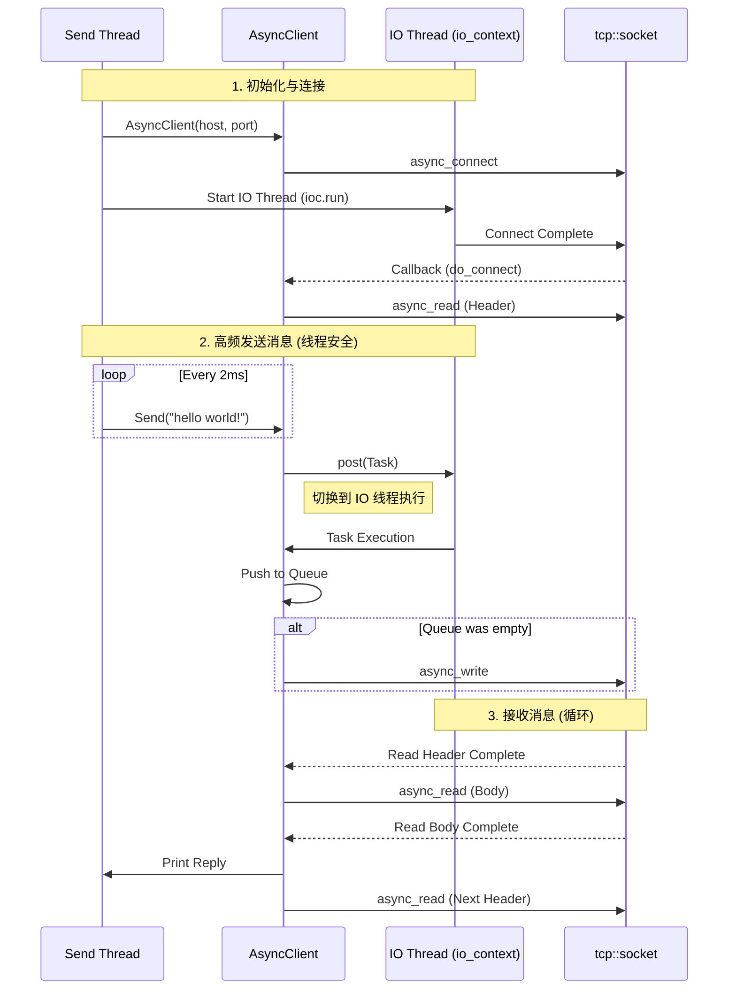
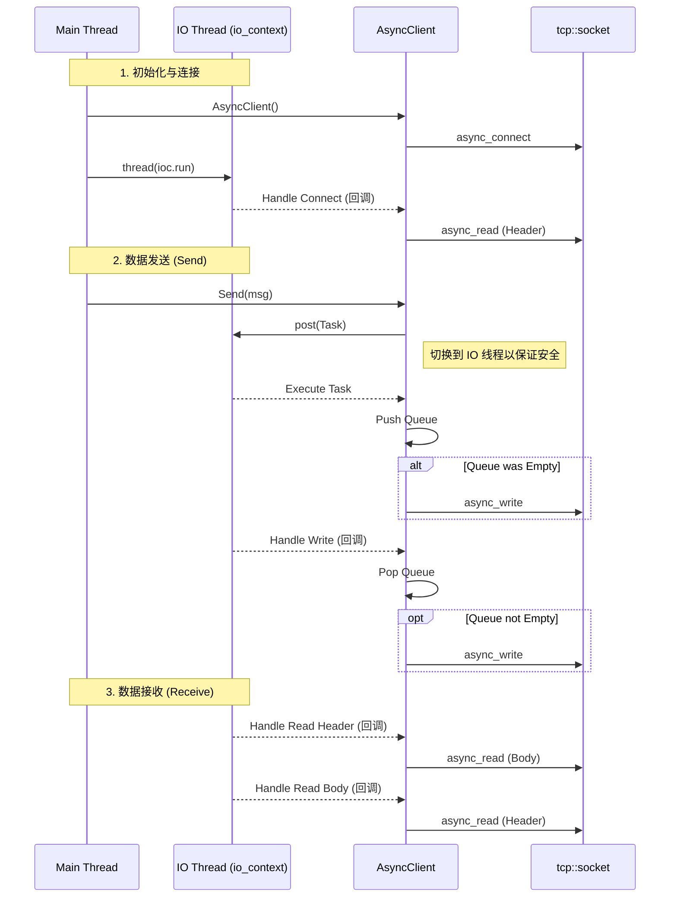

# Async Client 学习笔记

这是一个基于 Boost.Asio 的**异步 (Asynchronous)** TCP 客户端实现。它被设计为与 `v2_FullDuplex` 服务器配合使用，支持全双工通信和自定义消息协议。

## 目录结构

```
AsyncClient/
├── AsyncClient.h      # 客户端类声明
├── AsyncClient.cpp    # 客户端类实现
├── main.cpp           # 主程序入口
└── README.md          # 说明文档
```

## 核心功能

1.  **全双工通信**: 
    - 发送和接收互不干扰。
    - 使用 `io_context` 在后台线程处理网络 I/O。
    - 独立的发送线程 (`send_thread`) 模拟高频业务请求。

2.  **发送队列 (`_send_queue`)**:
    - 解决了 Boost.Asio 不允许并发 `async_write` 的问题。
    - `Send()` 函数是线程安全的，通过 `boost::asio::post` 将任务投递到 I/O 线程执行。

3.  **消息协议**:
    - 采用 `Header (2 bytes) + Body` 的格式。
    - 解决了 TCP 粘包问题。
    - 与服务器端的 `MsgNode` 协议保持一致。

## 程序逻辑详解

本客户端采用 **多线程 + 异步 I/O** 的架构，通过 `boost::asio::io_context` 调度所有网络操作。程序运行时存在三个并发执行流，它们的分工与协作如下：

### 1. 主线程 (Main Thread) - 资源管家
主线程负责程序的生命周期管理，不直接参与网络 I/O。
*   **初始化**: 调用 `WSAStartup` 初始化 Windows Socket 环境，创建核心对象 `io_context`。
*   **启动连接**: 实例化 `AsyncClient`，构造函数中立即调用 `async_connect` 发起非阻塞连接请求。
*   **创建线程**: 
    *   创建 `t` 线程运行 `ioc.run()`，启动异步引擎。
    *   创建 `send_thread` 线程运行业务逻辑。
*   **等待退出**: 调用 `join()` 阻塞等待子线程结束，防止主程序过早退出。

### 2. IO 线程 (IO Thread) - 异步引擎
该线程运行 `ioc.run()`，是所有异步回调函数（Handlers）的执行场所。它负责实际的“脏活累活”。
*   **接收循环 (Read Loop)**:
    1.  连接成功后，立即发起 `async_read` 读取 2 字节头部。
    2.  头部读取完成后，回调函数解析出消息长度，再次发起 `async_read` 读取包体。
    3.  包体读取完成后，打印消息，并立即回到第 1 步读取下一个头部。
    *   *机制*: 这是一个无限链式回调，确保只要有数据到达就能被处理。
*   **发送逻辑 (Write Logic)**:
    *   响应 `post` 投递过来的发送任务。
    *   将消息压入 `_send_queue`。
    *   检查当前是否正在发送（`write_in_progress`）。如果空闲，则调用 `async_write` 发送队首消息。
    *   发送完成的回调中，弹出队首，如果队列不空，继续发送下一条。
    *   *机制*: 保证了即使业务层疯狂调用 Send，底层的 Socket 也永远是串行写入，不会崩溃。

### 3. 发送线程 (Send Thread) - 业务模拟
该线程模拟高频产生数据的业务场景。
*   **死循环**: 包含一个 `while(true)` 循环。
*   **频率控制**: 使用 `std::this_thread::sleep_for(2ms)` 控制发送频率。
*   **跨线程投递**: 调用 `client.Send("hello world!")`。
    *   *关键点*: `Send` 函数内部并没有直接操作 Socket，而是使用 `boost::asio::post` 将一个 Lambda 表达式“扔”给 IO 线程去执行。这就像是把信件丢进邮筒，发送线程不需要等待信件寄出就可以继续执行。

## 调用关系图解



## 关键代码解析

### 1. 线程安全的发送 (Send)

```cpp
void AsyncClient::Send(const string& msg) {
    // 使用 post 将任务切到 io_context 线程，避免多线程竞争 socket
    boost::asio::post(_socket.get_executor(), [this, msg]() {
        bool write_in_progress = !_send_queue.empty();
        // ... 封装消息 ...
        _send_queue.push(send_data);
        if (!write_in_progress) {
            do_write();
        }
    });
}
```

### 2. 读写循环

-   **读取**: `do_read_header` -> `do_read_body` -> `do_read_header` ... (无限循环，直到出错)
-   **写入**: `do_write` -> 回调中检查队列 -> 若不空则再次 `do_write`。

## 编译与运行

### 编译命令 (MinGW)

```bash
g++ -o AsyncClient.exe main.cpp AsyncClient.cpp -lws2_32 -lboost_system -std=c++20
```

### 运行

1.  确保服务器 (`AsyncServer.exe`) 正在运行。
2.  运行客户端:
    ```bash
    ./AsyncClient.exe
    ```
3.  客户端启动后会自动开启一个发送线程，每隔 2ms 发送一条 "hello world!"。
4.  控制台将持续打印服务器的回显消息。

## 调用关系图解 (Call Flow)

以下时序图展示了主线程（用户输入）与 IO 线程（网络处理）之间的交互：


