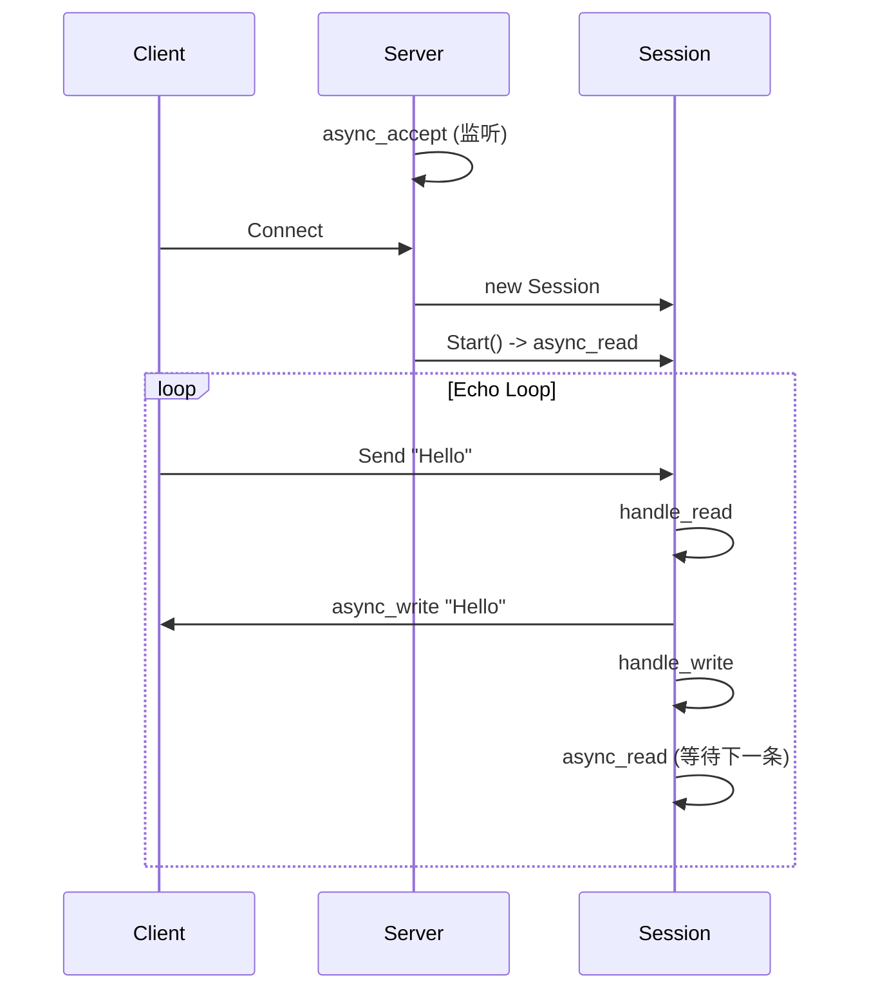

# 🚀 Async Echo Server (Boost.Asio)

> 一个基于 **C++20** 和 **Boost.Asio** 实现的高性能异步 TCP 回显服务器 (Echo Server)。

  

该项目展示了现代 C++ 网络编程的核心模式，包括 **异步 IO**、**智能指针生命周期管理**、以及 **Server-Session 架构设计**。

---

## ✨ 核心特性

- **⚡ 全异步架构 (Proactor)**  
  使用 `io_context` 和 `async_*` 系列函数，单线程即可处理高并发连接。

- **🧠 智能生命周期管理**  
  - 利用 `std::shared_ptr` 和 `std::enable_shared_from_this` 自动管理 `Session` 对象的生命周期。
  - 通过“回调链”机制（Read -> Write -> Read）保持会话存活。

- **🏗️ Server-Session 分离**  
  - `Server` 类：专注于监听端口 (`Accept`) 和连接管理。
  - `Session` 类：专注于单个客户端的数据交互 (`Read/Write`)。

- **🆔 UUID 会话管理**  
  每个连接分配唯一 UUID，并在 Server 端通过 `std::map` 统一管理。

---

## 🔍 关键技术解析：伪闭包与生命周期延长

在异步编程中，最棘手的问题之一是 **对象的生命周期管理**。当 `async_read` 立即返回后，如果 `Session` 对象被销毁，后续的回调函数执行时就会访问非法内存（野指针）。

本项目通过 **`std::bind` + `shared_from_this()`** 模拟了类似闭包（Closure）的效果，巧妙地解决了这个问题。

### 💡 原理解析

1.  **引用计数机制**  
    `Session` 继承自 `std::enable_shared_from_this`。调用 `shared_from_this()` 会创建一个指向自身的 `std::shared_ptr`，使引用计数 `+1`。

2.  **绑定与捕获**  
    ```cpp
    // 伪代码示例
    auto callback = std::bind(&Session::handle_read, this, ..., shared_from_this());
    ```
    `std::bind` 生成了一个函数对象（Functor）。这个对象内部保存了所有参数的副本。因此，`shared_ptr` 被“捕获”并存储在这个回调对象中。

3.  **所有权转移**  
    我们将这个回调对象传递给 `_socket.async_read_some(...)`。此时，**Boost.Asio 的底层队列持有该回调对象**。
    > **持有链**：`io_context` (队列) -> `Callback对象` -> `shared_ptr` -> `Session对象`。

4.  **自动释放**  
    - 只要异步操作未完成，回调对象就在队列中，`Session` 就不会死。
    - 当异步操作完成，`handle_read` 被调用。
    - 函数执行完毕后，回调对象被销毁 -> `shared_ptr` 析构 -> 引用计数 `-1`。
    - 如果此时没有新的异步操作发起（即没有新的 `bind`），且 `Server` map 中也移除了它，`Session` 就会自动析构。

这种方式确保了：
> **“只要还有任务在办，对象就绝不会死；一旦任务办完且无人挽留，对象立即安息”**。

---

## 📂 代码结构

| 文件 | 描述 |
| :--- | :--- |
| **`Server_demo.h/cpp`** | **服务器核心**<br>- `start_accept()`: 异步等待新连接。<br>- `handle_accept()`: 处理新连接，创建 Session 并启动。<br>- `ClearSession()`: 清理断开的连接。 |
| **`Session_demo.h/cpp`** | **会话逻辑**<br>- `Start()`: 启动读写循环。<br>- `handle_read()`: 收到数据后，发起异步写操作（回显）。<br>- `handle_write()`: 发送完成后，发起异步读操作（等待新数据）。 |

---

## 🛠️ 核心组件与库原理解析

### 1. 关键库的使用说明

- **`Boost.Asio` (Asynchronous Input/Output)**
  - **`io_context`**: 程序的“心脏”和调度器。它维护一个任务队列，当操作系统完成底层的 I/O 操作（如网卡收到数据）时，`io_context` 会将对应的回调函数唤醒并执行。
  - **`ip::tcp::acceptor`**: 专门用于监听端口的对象。它像一个“门卫”，只负责接受连接，不负责后续通信。
  - **`ip::tcp::socket`**: 代表一个建立好的 TCP 连接。数据的读 (`read`) 和写 (`write`) 都在这里进行。

- **`Boost.UUID`**
  - 用于生成 **通用唯一识别码 (UUID)**。在分布式或高并发系统中，简单的整数 ID (1, 2, 3...) 容易冲突或难以管理。UUID 保证了每个 Session 都有一个全球唯一的身份证号。

- **`std::memory` (智能指针)**
  - **`std::shared_ptr`**: 引用计数智能指针。这是异步编程的基石，确保了“只要还有人（或回调函数）需要这个对象，它就不会被销毁”。
  - **`std::enable_shared_from_this`**: 一个特殊的基类。它允许 `Session` 对象在自己的成员函数里安全地生成指向自己的 `shared_ptr`。这是实现“伪闭包”生命周期管理的关键技术。

### 2. 类结构设计原理

#### `class Server`
- **角色**: 连接工厂与总管。
- **`_sessions` (std::map)**:
  - 这是一个“户籍名册”，存储了 `uuid -> shared_ptr<Session>` 的映射。
  - **原理**: 除了异步回调函数持有 Session 外，Server 也持有一份。这允许 Server 主动管理连接（如踢掉某个用户、统计在线人数）。当连接断开时，必须从这里移除，否则 Session 永远不会释放（内存泄漏）。

#### `class Session`
- **角色**: 独立的连接管家。
- **`_data` (缓冲区)**:
  - **原理**: 在异步编程中，`async_read` 只是发起请求，数据可能在几毫秒后才到达。因此，缓冲区必须在整个等待期间保持有效。我们将 `_data` 定义为 `Session` 的成员变量，只要 `Session` 活着，缓冲区就活着，从而避免了栈内存失效的问题。

### 3. 关键函数原理解析

- **`Server::start_accept()`**:
  - **预创建模式**: 注意代码中是先 `new Session`，再调用 `async_accept`。这是因为 `async_accept` 需要一个现成的、空的 Socket 对象来存放即将到来的连接句柄。

- **`Session::handle_read()`**:
  - **读写接力**: 它是“读”的终点，也是“写”的起点。收到数据后，它立即调用 `async_write` 将数据发回。
  - **生命周期传递**: 它接收 `_self_shared` 参数，确保在处理数据期间 Session 不死。然后将这个 `_self_shared` 传递给下一个 `handle_write`。

---

## 💻 编译与运行

### 依赖
- C++ 编译器 (支持 C++11 及以上，推荐 C++20)
- Boost 库 (主要使用 `Boost.Asio`, `Boost.System`, `Boost.UUID`)

### 编译命令 (MinGW 示例)
```bash
g++ -o AsyncServer.exe AyncApi.cpp Server_demo.cpp Session_demo.cpp -lws2_32 -lboost_system
```
> **注意**：你需要创建一个包含 `main` 函数的入口文件，例如 `AyncApi.cpp`，在其中初始化 `io_context` 并启动 `Server`。

### 运行
1.  启动服务器：`./AsyncServer.exe`
2.  使用客户端连接（如 Telnet 或 Netcat）：
    ```bash
    telnet 127.0.0.1 10086
    ```
3.  输入任意字符，服务器将原样返回。

---

## 📊 设计细节图解


