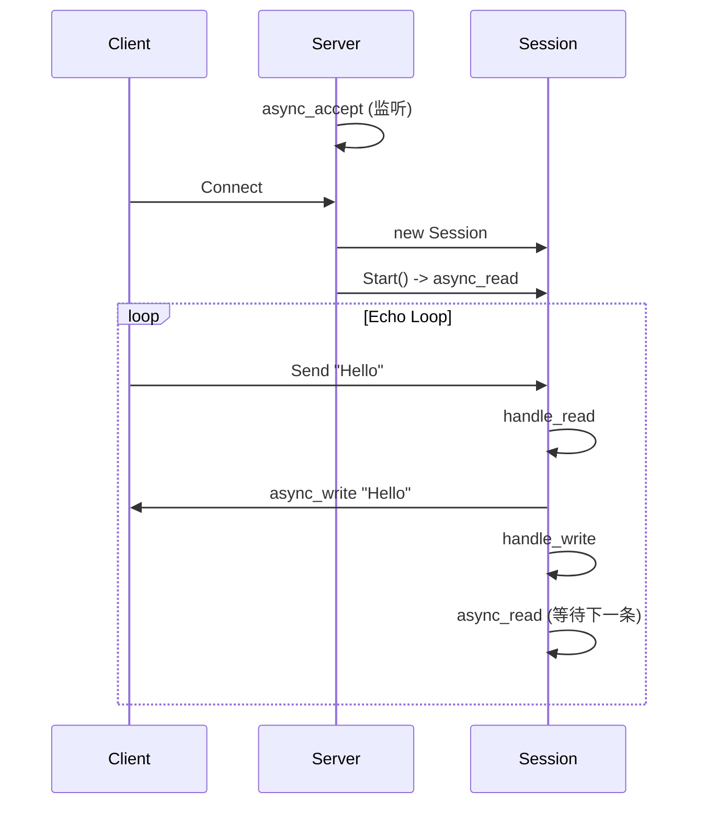

# Async Echo Server (Boost.Asio)

这是一个基于 C++20 和 `Boost.Asio` 实现的高性能异步 TCP 回显服务器 (Echo Server)。

该项目展示了现代 C++ 网络编程的核心模式，包括异步 IO、智能指针生命周期管理、以及 Server-Session 架构设计。

## 核心特性

*   **全异步架构 (Proactor)**：使用 `io_context` 和 `async_*` 系列函数，单线程即可处理高并发连接。
*   **智能生命周期管理**：
    *   利用 `std::shared_ptr` 和 `std::enable_shared_from_this` 自动管理 `Session` 对象的生命周期。
    *   通过“回调链”机制（Read -> Write -> Read）保持会话存活。
*   **Server-Session 分离**：
    *   `Server` 类：专注于监听端口 (`Accept`) 和连接管理。
    *   `Session` 类：专注于单个客户端的数据交互 (`Read/Write`)。
*   **UUID 会话管理**：每个连接分配唯一 UUID，并在 Server 端通过 `std::map` 统一管理。

## 代码结构

*   **`Server_demo.h/cpp`**: 服务器核心。
    *   `start_accept()`: 异步等待新连接。
    *   `handle_accept()`: 处理新连接，创建 Session 并启动。
    *   `ClearSession()`: 清理断开的连接。
*   **`Session_demo.h/cpp`**: 会话逻辑。
    *   `Start()`: 启动读写循环。
    *   `handle_read()`: 收到数据后，发起异步写操作（回显）。
    *   `handle_write()`: 发送完成后，发起异步读操作（等待新数据）。

## 编译与运行

### 依赖
*   C++ 编译器 (支持 C++11 及以上，推荐 C++20)
*   Boost 库 (主要使用 `Boost.Asio`, `Boost.System`, `Boost.UUID`)

### 编译命令 (MinGW 示例)
```bash
g++ -o AsyncServer.exe AyncApi.cpp Server_demo.cpp Session_demo.cpp -lws2_32 -lboost_system
```
*(注意：你需要创建一个包含 `main` 函数的入口文件，例如 `AyncApi.cpp`，在其中初始化 `io_context` 并启动 `Server`)*

### 运行
1.  启动服务器：`./AsyncServer.exe`
2.  使用客户端连接（如 Telnet 或 Netcat）：
    ```bash
    telnet 127.0.0.1 10086
    ```
3.  输入任意字符，服务器将原样返回。

## 设计细节图解


