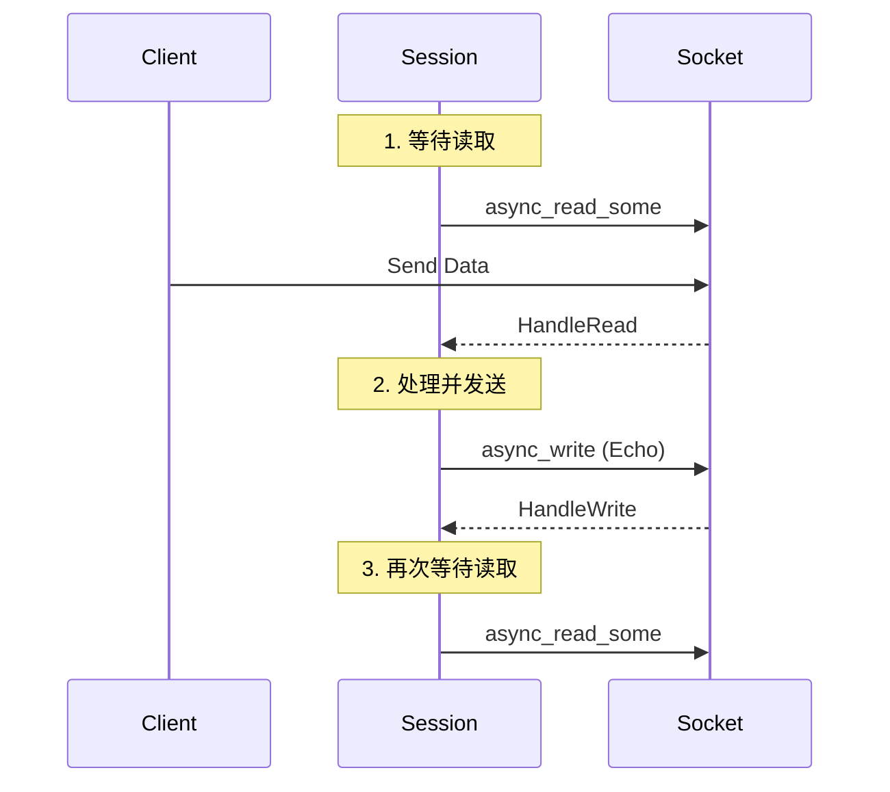
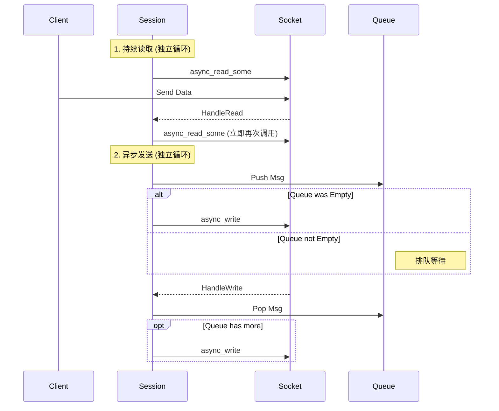
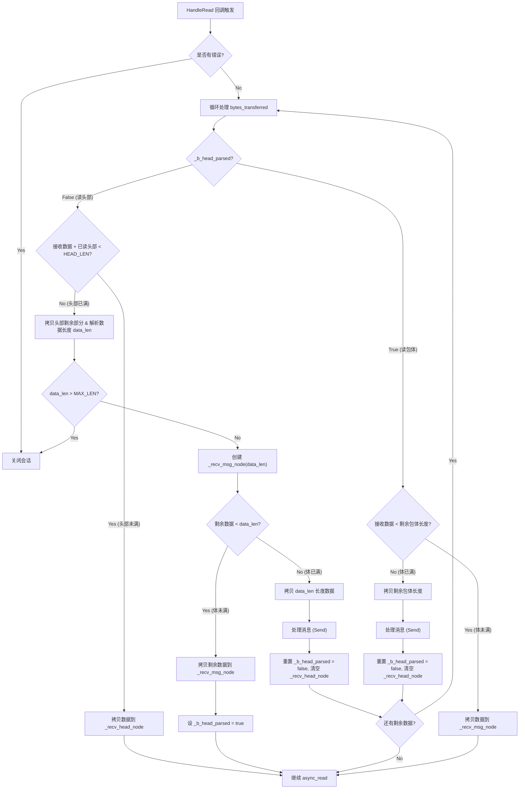
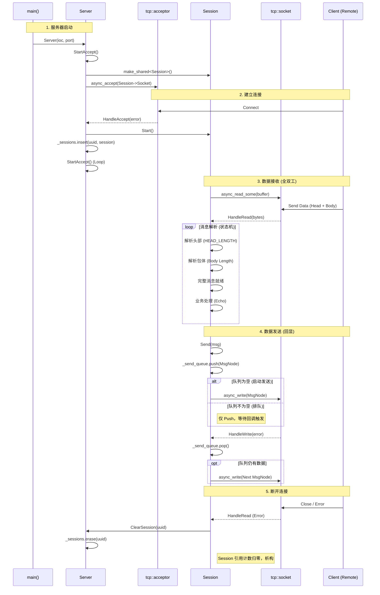

# Async Server 学习笔记

这个目录包含了一个基于 Boost.Asio 的**异步 (Asynchronous)** TCP 服务器实现。与同步服务器不同，异步服务器在单线程中通过回调机制处理并发连接，是高性能网络编程的主流模式。

## 版本说明 (Versions)

为了展示学习过程，本项目分为两个版本：

1.  **[v1_Simple](v1_Simple/)**: 
    - **初始版本**。
    - 采用"半双工"模式（读-写-读）。
    - 逻辑简单，但存在性能瓶颈和潜在的死锁风险。
    - 适合初学者理解异步回调的基本流程。

2.  **[v2_FullDuplex](v2_FullDuplex/)**:
    - **改进版本 (推荐)**。
    - 采用"全双工"模式（读写分离）。
    - 引入**发送队列** (`std::queue`) 解决并发写问题。
    - 引入**消息协议** (Header + Body) 解决 TCP 粘包/半包问题。
    - 更加健壮，接近生产环境的写法。

3.  **[AsyncClient](AsyncClient/)**:
    - **配套客户端**。
    - 实现了与 v2 服务器兼容的协议（Header + Body）。
    - 同样采用全双工异步模式，支持在主线程输入的同时接收服务器消息。
    - 演示了如何编写线程安全的异步客户端类。

## 架构对比 (v1 vs v2)

### v1_Simple: 半双工与直接发送

v1 版本采用最简单的 "Read -> Handle -> Write" 流程。



**存在的问题**:
1.  **半双工阻塞**: 必须等 `async_write` 完成后才能再次调用 `async_read`。如果发送数据量大或网络慢，服务器将无法及时处理客户端的新请求。
2.  **并发写崩溃**: 如果业务逻辑需要在 `HandleRead` 之外（例如定时器、其他线程）发送数据，可能会导致多个 `async_write` 同时操作同一个 Socket，引发崩溃。
3.  **粘包问题**: 没有定义消息边界，如果客户端发送 "Hello" 和 "World" 很快，服务器可能一次读到 "HelloWorld"，导致逻辑错误。

### v2_FullDuplex: 全双工与队列机制

v2 版本引入了 **发送队列** 和 **消息协议**，实现了真正的全双工通信。



**改进带来的益处**:
1.  **全双工通信**: 读和写完全分离。即使正在发送大数据，服务器依然能立即响应新的读取请求。
2.  **线程安全与串行化**: 通过 `std::queue` 和 `std::mutex`，确保同一时刻只有一个 `async_write` 在执行，无论多少个线程同时调用 `Send()` 都是安全的。
3.  **解决粘包**: 引入 `MsgNode` 和头部协议（Header Length + Body），配合状态机解析，确保每次都能拿到完整的业务包。
4.  **生命周期管理**: `MsgNode` 独立管理数据内存，避免了异步操作中缓冲区失效的问题。

## 核心架构解析 (基于 v2_FullDuplex)

### 1. 核心数据结构：MsgNode

`MsgNode` 类用于管理消息数据的生命周期，确保在异步操作期间数据有效。

| 成员变量 | 类型 | 说明 |
| :--- | :--- | :--- |
| `_total_len` | `int` | 消息的总长度。对于发送节点，包含头部+数据；对于接收节点，为数据体长度。 |
| `_cur_len` | `int` | 当前已处理（已发送或已接收）的长度。 |
| `_msg` | `char*` | 实际的数据缓冲区。 |

### 2. 会话管理：Session 类

`Session` 类负责处理单个连接的所有读写操作。

*   **生命周期管理**: 继承 `std::enable_shared_from_this`，利用 `shared_from_this()` 在异步回调中延长对象生命周期（伪闭包）。
*   **收发分离**: 
    *   **接收**: 使用 `HandleRead` 配合状态机处理粘包/半包。
    *   **发送**: 使用 `_send_queue` 配合 `HandleWrite` 实现串行化发送。

### 3. 接收逻辑 (HandleRead 状态机)

接收逻辑采用状态机设计，循环处理接收到的数据流，解决 TCP 粘包问题。



### 4. 发送逻辑 (队列机制)

Boost.Asio 要求同一个 Socket 在同一时间只能有一个 `async_write` 操作。

*   **Send**: 加锁 -> 封装 MsgNode -> 入队 -> 若队列原为空则触发 `async_write`。
*   **HandleWrite**: 检查错误 -> 弹出队首 -> 若队列不空则继续 `async_write`。

## 完整交互流程 (v2)



## 常见问题与陷阱 (Troubleshooting)

### 1. 循环引用与前向声明
*   **问题**: Server 和 Session 互相引用导致编译错误。
*   **解决**: 头文件中使用 `class Server;` 前向声明，源文件中包含 `#include "Server_demo.h"`。

### 2. 异步写操作的并发问题
*   **问题**: 直接连续调用 `async_write` 会导致 Socket 崩溃。
*   **解决**: 使用 `std::queue` 保证同一时刻只有一个写操作。

### 3. 粘包与半包
*   **问题**: TCP 是流式协议，一次 `read` 可能读到半个包或多个包。
*   **解决**: 定义消息协议（头部长度+包体），使用状态机在 `HandleRead` 中循环解析。

## 编译与运行

### 依赖
- C++ 编译器 (支持 C++11 及以上，推荐 C++20)
- Boost 库 (主要使用 `Boost.Asio`, `Boost.System`, `Boost.UUID`)

### 编译命令 (MinGW 示例)
```bash
g++ -o AsyncServer.exe AsyncServer.cpp Server_demo.cpp Session_demo.cpp -lws2_32 -lboost_system
```
