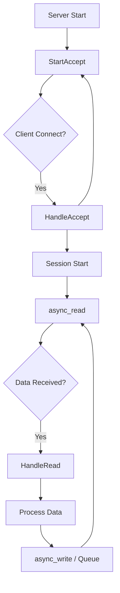
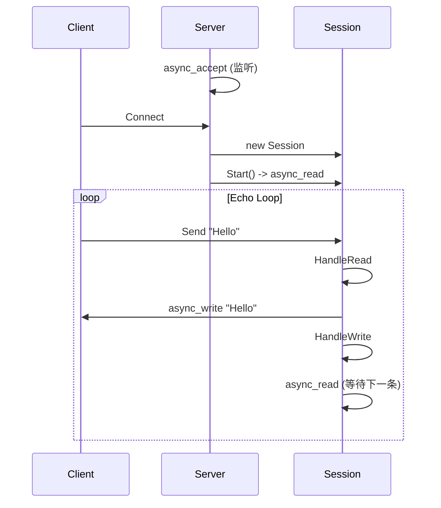

# Async Server 学习笔记

这个目录包含了一个基于 Boost.Asio 的**异步 (Asynchronous)** TCP 服务器实现。与同步服务器不同，异步服务器在单线程中通过回调机制处理并发连接，是高性能网络编程的主流模式。

## 核心架构

### 1. Server 类 (`Server_demo`)
*   **职责**：只负责监听端口和接受新连接。
*   **流程**：
    1.  `StartAccept()`: 创建一个新的 `Session` 对象（智能指针管理）。
    2.  `async_accept()`: 发起异步接受请求。
    3.  `HandleAccept()`: 当有客户端连接时被调用。启动 Session (`new_session->Start()`)，并将 Session 保存到 `_sessions` 映射表中（防止 Session 刚创建就被销毁）。然后再次调用 `StartAccept()` 等待下一个连接。

### 2. Session 类 (`Session_demo`)
*   **职责**：负责与单个客户端的所有数据交互（读/写）。
*   **生命周期管理 (关键点)**：
    *   继承自 `std::enable_shared_from_this<Session>`。
    *   **核心问题**：异步操作（如 `async_read`）是非阻塞的，函数立即返回。如果 `Session` 对象在回调触发前被销毁，程序会崩溃。
    *   **解决方案**：在绑定回调函数时，使用 `shared_from_this()`。
        ```cpp
        std::bind(&Session::HandleRead, this, ..., shared_from_this())
        ```
        这会将 `Session` 的智能指针拷贝一份存入回调函数对象中（由 Asio 底层队列持有）。只要回调函数未执行，`Session` 的引用计数就至少为 1，从而保证对象存活。

### 3. MsgNode与发送队列 (进阶设计)
*   **背景**：在 `Session_demo.h` 中引入了 `MsgNode` 和 `_send_queue`。
*   **目的**：
    *   **数据生命周期**：`async_write` 是异步的，底层缓冲区必须在发送完成前保持有效。`MsgNode` 负责持有数据所有权。
    *   **并发写保护**：Boost.Asio 禁止在同一个 Socket 上并发发起多个 `async_write`。通过 `_send_queue` 队列，我们可以确保消息按顺序发送，且同一时刻只有一个写操作在进行（即 "串行化写操作"）。

## 代码流程图解



## 关键代码解析

### 伪闭包 (Pseudo-closure)
在 `Session_demo.cpp` 中：
```cpp
void Session::Start(){
    // ...
    _socket.async_read_some(..., 
        std::bind(&Session::HandleRead, this, ..., shared_from_this()));
}
```
这里的 `shared_from_this()` 是异步服务器不崩溃的基石。它延长了对象的生命周期，直到回调执行完毕。

### UUID 管理
每个 Session 被分配一个唯一的 UUID，并存储在 `Server::_sessions` map 中。这不仅是为了查找，也是为了在某些逻辑下（如踢人、广播）能管理所有连接。

## 常见问题与陷阱 (Troubleshooting)

### 1. 循环引用与前向声明 (Forward Declaration)
在 C++ 中，当两个类互相引用时（Server 需要引用 Session，Session 需要引用 Server），容易出现编译错误。

*   **问题现象**：编译报错 `incomplete type 'class Server'` 或 `unknown type name 'Server'`。
*   **原因**：头文件互相 `#include` 导致循环依赖，编译器无法确定类的定义。
*   **解决方案**：
    1.  **头文件 (`.h`)**：只使用 **前向声明** (`class Server;`)，**不要**包含对方的头文件。
    2.  **源文件 (`.cpp`)**：包含对方的头文件 (`#include "Server_demo.h"`)，因为实现代码需要知道类的具体定义（如调用成员函数）。

**代码示例**：
*   `Session_demo.h`:
    ```cpp
    class Server; // 前向声明
    class Session { ... Server* _server; ... };
    ```
*   `Session_demo.cpp`:
    ```cpp
    #include "Session_demo.h"
    #include "Server_demo.h" // 必须包含，否则无法调用 _server->ClearSession()
    ```

### 2. 异步写操作的并发问题
*   **错误做法**：在 `HandleRead` 中直接调用 `async_write`，如果不加判断地连续调用，可能会导致 Socket 崩溃。
*   **正确做法**：使用发送队列。每次只发送队列头部的数据，发送完成后在回调中检查队列，如果还有数据则继续发送。

## 思考题
1.  **引用循环**：`Server` 持有 `Session` 的 `shared_ptr` (在 map 中)，而 `Session` 如果也持有 `Server` 的 `shared_ptr` 会发生什么？（当前代码 `Session` 持有的是 `Server*` 裸指针，避免了循环引用）。
2.  **队列实现**：当前的 `.cpp` 实现中，`HandleRead` 直接调用了 `async_write`。如果客户端发送速度极快，导致服务器需要连续回复多条消息，直接调用 `async_write` 是否安全？（提示：不安全，应该使用 `_send_queue` 改造）。

4.  **自动释放**  
    - 只要异步操作未完成，回调对象就在队列中，`Session` 就不会死。
    - 当异步操作完成，`HandleRead` 被调用。
    - 函数执行完毕后，回调对象被销毁 -> `shared_ptr` 析构 -> 引用计数 `-1`。
    - 如果此时没有新的异步操作发起（即没有新的 `bind`），且 `Server` map 中也移除了它，`Session` 就会自动析构。

这种方式确保了：
> **“只要还有任务在办，对象就绝不会死；一旦任务办完且无人挽留，对象立即安息”**。

---

## 📂 代码结构

| 文件 | 描述 |
| :--- | :--- |
| **`Server_demo.h/cpp`** | **服务器核心**<br>- `StartAccept()`: 异步等待新连接。<br>- `HandleAccept()`: 处理新连接，创建 Session 并启动。<br>- `ClearSession()`: 清理断开的连接。 |
| **`Session_demo.h/cpp`** | **会话逻辑**<br>- `Start()`: 启动读写循环。<br>- `HandleRead()`: 收到数据后，发起异步写操作（回显）。<br>- `HandleWrite()`: 发送完成后，发起异步读操作（等待新数据）。 |
| **`MsgNode.h`** | **消息节点**<br>- 管理发送数据的生命周期。<br>- 处理 TCP 拆包/粘包的基础结构（目前为 Header-only 实现）。 |

---

## 🛠️ 核心组件与库原理解析

### 1. 关键库的使用说明

- **`Boost.Asio` (Asynchronous Input/Output)**
  - **`io_context`**: 程序的“心脏”和调度器。它维护一个任务队列，当操作系统完成底层的 I/O 操作（如网卡收到数据）时，`io_context` 会将对应的回调函数唤醒并执行。
  - **`ip::tcp::acceptor`**: 专门用于监听端口的对象。它像一个“门卫”，只负责接受连接，不负责后续通信。
  - **`ip::tcp::socket`**: 代表一个建立好的 TCP 连接。数据的读 (`read`) 和写 (`write`) 都在这里进行。

- **`Boost.UUID`**
  - 用于生成 **通用唯一识别码 (UUID)**。在分布式或高并发系统中，简单的整数 ID (1, 2, 3...) 容易冲突或难以管理。UUID 保证了每个 Session 都有一个全球唯一的身份证号。

- **`std::memory` (智能指针)**
  - **`std::shared_ptr`**: 引用计数智能指针。这是异步编程的基石，确保了“只要还有人（或回调函数）需要这个对象，它就不会被销毁”。
  - **`std::enable_shared_from_this`**: 一个特殊的基类。它允许 `Session` 对象在自己的成员函数里安全地生成指向自己的 `shared_ptr`。这是实现“伪闭包”生命周期管理的关键技术。

### 2. 类结构设计原理

#### `class Server`
- **角色**: 连接工厂与总管。
- **`_sessions` (std::map)**:
  - 这是一个“户籍名册”，存储了 `uuid -> shared_ptr<Session>` 的映射。
  - **原理**: 除了异步回调函数持有 Session 外，Server 也持有一份。这允许 Server 主动管理连接（如踢掉某个用户、统计在线人数）。当连接断开时，必须从这里移除，否则 Session 永远不会释放（内存泄漏）。

#### `class Session`
- **角色**: 独立的连接管家。
- **`_recv_buffer` (缓冲区)**:
  - **原理**: 在异步编程中，`async_read` 只是发起请求，数据可能在几毫秒后才到达。因此，缓冲区必须在整个等待期间保持有效。我们将 `_recv_buffer` 定义为 `Session` 的成员变量，只要 `Session` 活着，缓冲区就活着，从而避免了栈内存失效的问题。

### 3. 关键函数原理解析

- **`Server::StartAccept()`**:
  - **预创建模式**: 注意代码中是先 `new Session`，再调用 `async_accept`。这是因为 `async_accept` 需要一个现成的、空的 Socket 对象来存放即将到来的连接句柄。

- **`Session::HandleRead()`**:
  - **读写接力**: 它是“读”的终点，也是“写”的起点。收到数据后，它立即调用 `async_write` 将数据发回。
  - **生命周期传递**: 它接收 `_self_shared` 参数，确保在处理数据期间 Session 不死。然后将这个 `_self_shared` 传递给下一个 `HandleWrite`。

---

## 💻 编译与运行

### 依赖
- C++ 编译器 (支持 C++11 及以上，推荐 C++20)
- Boost 库 (主要使用 `Boost.Asio`, `Boost.System`, `Boost.UUID`)

### 编译命令 (MinGW 示例)
```bash
g++ -o AsyncServer.exe AsyncServer.cpp Server_demo.cpp Session_demo.cpp -lws2_32 -lboost_system
```
> **注意**：`AsyncServer.cpp` 是包含 `main` 函数的入口文件。`MsgNode` 目前在头文件中实现，无需单独编译 `.cpp`。

### 运行
1.  启动服务器：`./AsyncServer.exe`
2.  使用客户端连接（如 Telnet 或 Netcat）：
    ```bash
    telnet 127.0.0.1 10086
    ```
3.  输入任意字符，服务器将原样返回。

---

## 📊 设计细节图解


