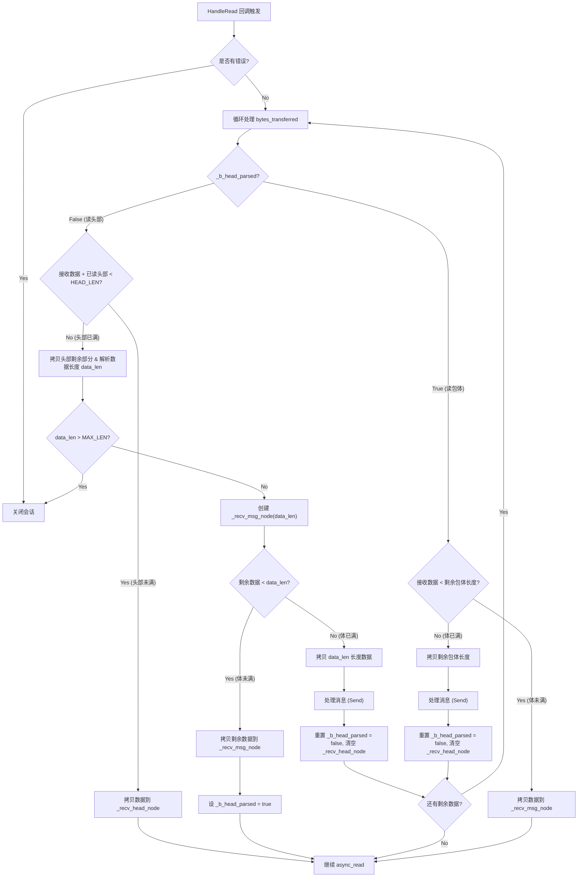
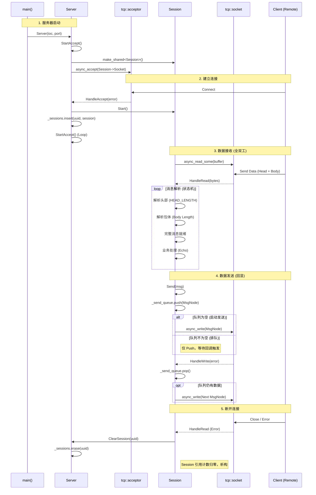

# Async Server 全双工通信实现 (v2_FullDuplex)

本目录包含了一个基于 Boost.Asio 的全双工异步 TCP 服务器实现。相比于 v1 版本，v2 版本引入了完善的消息协议（头部+包体）和发送队列，解决了 TCP 粘包/半包问题以及多线程并发发送的安全问题。

## 1. 核心数据结构：MsgNode

`MsgNode` 类用于管理消息数据的生命周期，确保在异步操作期间数据有效。

### 结构体成员

| 成员变量 | 类型 | 说明 |
| :--- | :--- | :--- |
| `_total_len` | `int` | 消息的总长度。对于发送节点，包含头部+数据；对于接收节点，为数据体长度。 |
| `_cur_len` | `int` | 当前已处理（已发送或已接收）的长度。 |
| `_msg` | `char*` | 实际的数据缓冲区。 |

### 构造函数

1.  **发送构造** (`MsgNode(const char* msg, int total_len)`)
    *   用于构造待发送的消息。
    *   **逻辑**：分配 `total_len + HEAD_LENGTH` 大小的空间。先将 `total_len` (消息体长度) 写入头部（前2字节），然后拷贝 `msg` 到剩余空间。
    *   **目的**：自动封装协议头，接收端可以根据头部解析出消息长度。

2.  **接收构造** (`MsgNode(int total_len)`)
    *   用于构造接收缓存。
    *   **逻辑**：仅分配 `total_len` 大小的空间。
    *   **目的**：在解析出头部长度后，创建一个定长的容器来接收后续的消息体。

---

## 2. 服务器架构：Server 类

`Server` 类负责监听端口、接受连接以及管理所有活跃的会话。

### 核心逻辑

1.  **启动监听 (`StartAccept`)**
    *   创建一个新的 `Session` 对象（使用 `shared_ptr` 管理）。
    *   调用 `_acceptor.async_accept`，将新 Session 的 Socket 传入。
    *   **注意**：此时 Session 尚未启动，仅分配了资源等待连接。

2.  **处理连接 (`HandleAccept`)**
    *   当有客户端连接时，回调触发。
    *   **启动会话**：调用 `new_session->Start()`，开始异步读取数据。
    *   **管理会话**：将 `new_session` 存入 `_sessions` map 中。这是为了增加引用计数，防止 `shared_ptr` 在函数结束后销毁 Session 对象。
    *   **循环接受**：再次调用 `StartAccept()`，准备接受下一个连接。

3.  **清理会话 (`ClearSession`)**
    *   当 Session 发生错误或断开时调用。
    *   从 `_sessions` map 中移除对应的 UUID。
    *   **结果**：Session 的引用计数减 1。如果异步操作也都完成，Session 将自动析构。

---

## 3. 会话管理：Session 类

`Session` 类负责处理单个连接的所有读写操作。

### 关键成员变量

| 成员变量 | 说明 |
| :--- | :--- |
| `_recv_head_node` | `shared_ptr<MsgNode>`。固定长度（如2字节），用于接收消息头部。 |
| `_recv_msg_node` | `shared_ptr<MsgNode>`。动态长度，用于接收消息体。长度由头部解析得出。 |
| `_b_head_parsed` | `bool`。状态标志位。`false` 表示正在接收头部，`true` 表示头部已就绪，正在接收消息体。 |
| `_send_queue` | `queue<shared_ptr<MsgNode>>`。发送队列，缓存待发送的消息。 |
| `_send_lock` | `mutex`。互斥锁，保护发送队列的线程安全。 |

---

## 4. 逻辑实现详解

### 4.1 接收逻辑 (HandleRead - 解决粘包/半包)

接收逻辑采用**状态机**设计，循环处理接收到的数据流。

**状态机流程图：**

**详细步骤：**

1.  **头部解析阶段 (`!_b_head_parsed`)**
    *   **目标**：凑齐 `HEAD_LENGTH` (2字节) 的头部数据。
    *   **逻辑**：
        *   如果接收的数据不足以填满头部，拷贝数据，继续 `async_read_some`。
        *   如果头部填满，解析出 `data_len` (消息体长度)。
        *   校验 `data_len` 是否合法（防止恶意大包）。
        *   预分配 `_recv_msg_node` 内存。
        *   切换状态 `_b_head_parsed = true`。
        *   **关键点**：如果缓冲区中还有剩余数据（粘包），直接进入下一阶段处理，不进行新的 IO 调用。

2.  **包体解析阶段 (`_b_head_parsed`)**
    *   **目标**：凑齐 `data_len` 长度的消息体。
    *   **逻辑**：
        *   计算还需要读取的长度 `remain_msg`。
        *   如果接收的数据不足 `remain_msg`，拷贝数据，继续 `async_read_some`。
        *   如果数据足够，拷贝完整消息体。
        *   **触发业务**：调用 `Send()` 回显数据。
        *   **重置状态**：`_b_head_parsed = false`，清空头部节点。
        *   **循环**：如果缓冲区还有剩余数据，回到步骤 1 继续解析（处理下一条消息）。

### 4.2 发送逻辑 (Send & HandleWrite - 解决并发写)

Boost.Asio 要求同一个 Socket 在同一时间只能有一个 `async_write` 操作。

**队列发送机制：**

1.  **Send 函数**
    *   加锁 `_send_lock`。
    *   将数据封装为 `MsgNode`（自动加头），推入 `_send_queue`。
    *   **检查**：如果推入前队列不为空，说明已有写操作在进行，直接返回。
    *   **启动**：如果推入前队列为空，调用 `async_write` 发送队首元素。

2.  **HandleWrite 回调**
    *   检查错误，若出错则断开连接。
    *   加锁，弹出队首元素 (`pop`)。
    *   **检查**：如果队列仍不为空，取出新的队首元素，再次调用 `async_write`。

---

## 5. 完整交互流程 (Client-Server Interaction)

下图展示了从服务器启动、客户端连接、数据交互到断开连接的完整调用关系。

