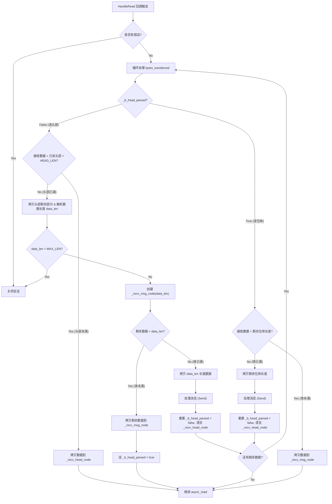

# Async Server 全双工通信实现 (v2_FullDuplex)

本目录包含了一个基于 Boost.Asio 的全双工异步 TCP 服务器实现。相比于 v1 版本，v2 版本引入了完善的消息协议（头部+包体）和发送队列，解决了 TCP 粘包/半包问题以及多线程并发发送的安全问题。

## 1. 核心数据结构：MsgNode

`MsgNode` 类用于管理消息数据的生命周期，确保在异步操作期间数据有效。

### 结构体成员

| 成员变量 | 类型 | 说明 |
| :--- | :--- | :--- |
| `_total_len` | `int` | 消息的总长度。对于发送节点，包含头部+数据；对于接收节点，为数据体长度。 |
| `_cur_len` | `int` | 当前已处理（已发送或已接收）的长度。 |
| `_msg` | `char*` | 实际的数据缓冲区。 |

### 构造函数

1.  **发送构造** (`MsgNode(const char* msg, int total_len)`)
    *   用于构造待发送的消息。
    *   **逻辑**：分配 `total_len + HEAD_LENGTH` 大小的空间。先将 `total_len` (消息体长度) 写入头部（前2字节），然后拷贝 `msg` 到剩余空间。
    *   **目的**：自动封装协议头，接收端可以根据头部解析出消息长度。

2.  **接收构造** (`MsgNode(int total_len)`)
    *   用于构造接收缓存。
    *   **逻辑**：仅分配 `total_len` 大小的空间。
    *   **目的**：在解析出头部长度后，创建一个定长的容器来接收后续的消息体。

---

## 2. 服务器架构：Server 类

`Server` 类负责监听端口、接受连接以及管理所有活跃的会话。

### 核心逻辑

1.  **启动监听 (`StartAccept`)**
    *   创建一个新的 `Session` 对象（使用 `shared_ptr` 管理）。
    *   调用 `_acceptor.async_accept`，将新 Session 的 Socket 传入。
    *   **注意**：此时 Session 尚未启动，仅分配了资源等待连接。

2.  **处理连接 (`HandleAccept`)**
    *   当有客户端连接时，回调触发。
    *   **启动会话**：调用 `new_session->Start()`，开始异步读取数据。
    *   **管理会话**：将 `new_session` 存入 `_sessions` map 中。这是为了增加引用计数，防止 `shared_ptr` 在函数结束后销毁 Session 对象。
    *   **循环接受**：再次调用 `StartAccept()`，准备接受下一个连接。

3.  **清理会话 (`ClearSession`)**
    *   当 Session 发生错误或断开时调用。
    *   从 `_sessions` map 中移除对应的 UUID。
    *   **结果**：Session 的引用计数减 1。如果异步操作也都完成，Session 将自动析构。

---

## 3. 会话管理：Session 类

`Session` 类负责处理单个连接的所有读写操作。

### 关键成员变量

| 成员变量 | 说明 |
| :--- | :--- |
| `_recv_head_node` | `shared_ptr<MsgNode>`。固定长度（如2字节），用于接收消息头部。 |
| `_recv_msg_node` | `shared_ptr<MsgNode>`。动态长度，用于接收消息体。长度由头部解析得出。 |
| `_b_head_parsed` | `bool`。状态标志位。`false` 表示正在接收头部，`true` 表示头部已就绪，正在接收消息体。 |
| `_send_queue` | `queue<shared_ptr<MsgNode>>`。发送队列，缓存待发送的消息。 |
| `_send_lock` | `mutex`。互斥锁，保护发送队列的线程安全。 |

---

## 4. 逻辑实现详解

### 4.1 接收逻辑 (HandleRead - 解决粘包/半包)

接收逻辑采用**状态机**设计，循环处理接收到的数据流。

**状态机流程图：**

```mermaid
graph TD
    Start[HandleRead 回调触发] --> CheckError{"是否有错误?"}
    CheckError -- Yes --> Close[关闭会话]
    CheckError -- No --> Loop[循环处理 bytes_transferred]
    
    Loop --> StateCheck{"_b_head_parsed?"}
    
    %% 状态1：解析头部
    StateCheck -- False (读头部) --> HeadCheck{"接收数据 + 已读头部 < HEAD_LEN?"}
    HeadCheck -- Yes (头部未满) --> CopyHeadPart[拷贝数据到 _recv_head_node]
    CopyHeadPart --> ContinueRead[继续 async_read]
    
    HeadCheck -- No (头部已满) --> ParseHead[拷贝头部剩余部分 & 解析数据长度 data_len]
    ParseHead --> LenCheck{"data_len > MAX_LEN?"}
    LenCheck -- Yes --> Close
    LenCheck -- No --> AllocBody["创建 _recv_msg_node(data_len)"]
    
    AllocBody --> BodyCheck{"剩余数据 < data_len?"}
    BodyCheck -- Yes (体未满) --> CopyBodyPart[拷贝剩余数据到 _recv_msg_node]
    CopyBodyPart --> SetFlag[设 _b_head_parsed = true]
    SetFlag --> ContinueRead
    
    BodyCheck -- No (体已满) --> CopyBodyFull[拷贝 data_len 长度数据]
    CopyBodyFull --> ProcessMsg["处理消息 (Send)"]
    ProcessMsg --> ResetHead[重置 _b_head_parsed = false, 清空 _recv_head_node]
    ResetHead --> LoopEnd{"还有剩余数据?"}
    LoopEnd -- Yes --> Loop
    LoopEnd -- No --> ContinueRead

    %% 状态2：解析包体
    StateCheck -- True (读包体) --> RemainCheck{"接收数据 < 剩余包体长度?"}
    RemainCheck -- Yes (体未满) --> CopyBodyPart2[拷贝数据到 _recv_msg_node]
    CopyBodyPart2 --> ContinueRead
    
    RemainCheck -- No (体已满) --> CopyBodyFull2[拷贝剩余包体长度]
    CopyBodyFull2 --> ProcessMsg2["处理消息 (Send)"]
    ProcessMsg2 --> ResetHead2[重置 _b_head_parsed = false, 清空 _recv_head_node]
    ResetHead2 --> LoopEnd
```

**详细步骤：**

---

### 4.1.1 HandleReadHead 与 HandleReadMsg 说明

在采用“包头+包体”协议时，推荐将异步读取分为两步：

- `HandleReadHead(const boost::system::error_code& error, size_t bytes_transferred, shared_ptr<Session> _self_shared)`
    - 负责异步读取消息头部后的处理。
    - 检查 error 和 bytes_transferred，确保头部收全。
    - 解析头部，获取消息体长度（data_len），校验合法性。
    - 分配消息体缓冲区，启动 async_read 读取消息体，回调 `HandleReadMsg`。

- `HandleReadMsg(const boost::system::error_code& error, size_t bytes_transferred, shared_ptr<Session> _self_shared)`
    - 负责异步读取消息体后的处理。
    - 检查 error，处理完整消息体（如打印、回显、业务逻辑等）。
    - 清理状态，准备读取下一个消息头（再次 async_read 头部，回调 `HandleReadHead`）。

这种“先读头，再读体”的异步收包方式，能有效应对定长包协议，简化粘包/半包处理。

---

### 4.1.2 与 HandleRead（单函数状态机）方式的对比

#### HandleRead（单函数状态机）
- 采用一个函数（HandleRead）配合状态变量（如 `_b_head_parsed`）来处理包头和包体。
- 每次 `async_read_some` 读取到数据后，循环判断当前是处理头部还是包体，手动切换状态、分配缓冲、处理粘包/半包。
- **优点**：灵活，能处理复杂的粘包、半包、多包等情况。
- **缺点**：代码复杂，状态切换和数据拷贝逻辑较多，维护难度大。

#### HandleReadHead + HandleReadMsg（分步回调）
- 明确分为两个回调函数：`HandleReadHead` 只负责读取和解析包头，`HandleReadMsg` 只负责读取和处理包体。
- 头部收全后直接进入包体读取，包体收全后再回到头部读取，流程清晰。
- **优点**：结构清楚，逻辑分明，易于维护，适合定长包协议。
- **缺点**：灵活性略低，若协议极为复杂（如变长头、嵌套包等）需适当扩展。

> 总结：
> - `HandleRead`（单函数状态机）适合需要极致灵活、能处理各种粘包/半包/多包场景的复杂协议。
> - `HandleReadHead` + `HandleReadMsg`（分步回调）适合典型的“包头+包体”定长协议，代码更易读、易维护。

1.  **头部解析阶段 (`!_b_head_parsed`)**
    *   **目标**：凑齐 `HEAD_LENGTH` (2字节) 的头部数据。
    *   **逻辑**：
        *   如果接收的数据不足以填满头部，拷贝数据，继续 `async_read_some`。
        *   如果头部填满，解析出 `data_len` (消息体长度)。
        *   校验 `data_len` 是否合法（防止恶意大包）。
        *   预分配 `_recv_msg_node` 内存。
        *   切换状态 `_b_head_parsed = true`。
        *   **关键点**：如果缓冲区中还有剩余数据（粘包），直接进入下一阶段处理，不进行新的 IO 调用。

2.  **包体解析阶段 (`_b_head_parsed`)**
    *   **目标**：凑齐 `data_len` 长度的消息体。
    *   **逻辑**：
        *   计算还需要读取的长度 `remain_msg`。
        *   如果接收的数据不足 `remain_msg`，拷贝数据，继续 `async_read_some`。
        *   如果数据足够，拷贝完整消息体。
        *   **触发业务**：调用 `Send()` 回显数据。
        *   **重置状态**：`_b_head_parsed = false`，清空头部节点。
        *   **循环**：如果缓冲区还有剩余数据，回到步骤 1 继续解析（处理下一条消息）。

### 4.2 发送逻辑 (Send & HandleWrite - 解决并发写)

Boost.Asio 要求同一个 Socket 在同一时间只能有一个 `async_write` 操作。

**队列发送机制：**

1.  **Send 函数**
    *   加锁 `_send_lock`。
    *   将数据封装为 `MsgNode`（自动加头），推入 `_send_queue`。
    *   **检查**：如果推入前队列不为空，说明已有写操作在进行，直接返回。
    *   **启动**：如果推入前队列为空，调用 `async_write` 发送队首元素。

2.  **HandleWrite 回调**
    *   检查错误，若出错则断开连接。
    *   加锁，弹出队首元素 (`pop`)。
    *   **检查**：如果队列仍不为空，取出新的队首元素，再次调用 `async_write`。

---

## 5. 完整交互流程 (Client-Server Interaction)

下图展示了从服务器启动、客户端连接、数据交互到断开连接的完整调用关系。

```mermaid
sequenceDiagram
    participant Main as main()
    participant Server as Server
    participant Acceptor as tcp::acceptor
    participant Session as Session
    participant Socket as tcp::socket
    participant Client as Client (Remote)

    Note over Main, Server: 1. 服务器启动
    Main->>Server: Server(ioc, port)
    Server->>Server: StartAccept()
    Server->>Session: make_shared<Session>()
    Server->>Acceptor: async_accept(Session->Socket)

    Note over Client, Acceptor: 2. 建立连接
    Client->>Acceptor: Connect
    Acceptor-->>Server: HandleAccept(error)
    Server->>Session: Start()
    Server->>Server: _sessions.insert(uuid, session)
    Server->>Server: StartAccept() (Loop)

    Note over Session, Client: 3. 数据接收 (全双工)
    Session->>Socket: async_read_some(buffer)
    Client->>Socket: Send Data (Head + Body)
    Socket-->>Session: HandleRead(bytes)
    
    loop 消息解析 (状态机)
        Session->>Session: 解析头部 (HEAD_LENGTH)
        Session->>Session: 解析包体 (Body Length)
        Session->>Session: 完整消息就绪
        Session->>Session: 业务处理 (Echo)
    end

    Note over Session, Client: 4. 数据发送 (回显)
    Session->>Session: Send(msg)
    Session->>Session: _send_queue.push(MsgNode)
    
    alt 队列为空 (启动发送)
        Session->>Socket: async_write(MsgNode)
    else 队列不为空 (排队)
        Note right of Session: 仅 Push，等待回调触发
    end

    Socket-->>Session: HandleWrite(error)
    Session->>Session: _send_queue.pop()
    
    opt 队列仍有数据
        Session->>Socket: async_write(Next MsgNode)
    end
    
    Note over Session, Client: 5. 断开连接
    Client->>Socket: Close / Error
    Socket-->>Session: HandleRead (Error)
    Session->>Server: ClearSession(uuid)
    Server->>Server: _sessions.erase(uuid)
    Note right of Session: Session 引用计数归零，析构

---


## 6. 近期代码变更

- 客户端（AsyncClient）已整体重构为异步多线程模型，采用分步回调收发、线程安全队列，消息协议与服务端完全一致，支持高频安全发送与回显。
- 消息体格式升级为 JSON 序列化，所有业务数据均以 JSON 字符串形式封装。例如：
    ```json
    {
        "cmd": "echo",
        "data": "hello world!",
        "timestamp": 1700000000
    }
    ```
- 这样便于客户端与服务端进行结构化数据交互，协议扩展更灵活。
- 服务端需同步支持 JSON 解析，确保兼容性。

- 新增 `HandleReadHead` 和 `HandleReadMsg` 两个分步回调函数，实现“先读头，再读体”的定长包协议异步收包方案，逻辑更清晰，易维护。
- Session 类相关成员变量和接口已同步调整，具体见头文件和实现。
- README 已补充分步回调方案说明，并与原有单函数状态机方案做了详细对比。
- 推荐优先采用分步回调方案处理定长包协议，复杂协议可参考状态机方式。
```
